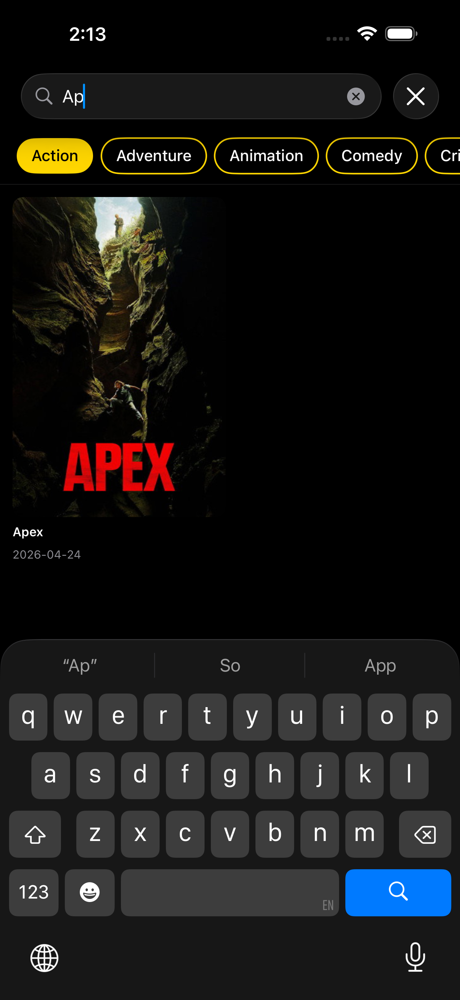
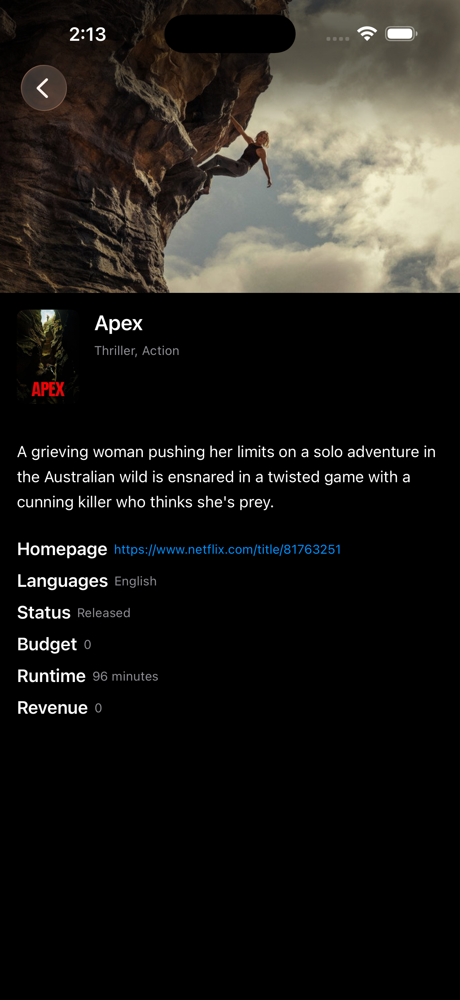

# Jahez Task

A modular iOS app built with SwiftUI that browses movies using the TMDB API.

| Movie List | Search | Movie Detail |
|:---:|:---:|:---:|
|  |  |  |

---

## Security

The TMDB bearer token is stored in `Jahez Task/Config/Secrets.xcconfig` and injected into the app at build time via `Info.plist` using `$(TMDB_BEARER_TOKEN)`.

---

## Architecture

```
┌─────────────────────────────────────────┐
│               JahezApp (main target)    │
│  ┌──────────────┐   ┌─────────────────┐ │
│  │   Features   │   │  ServiceLocator │ │
│  │  (Views +    │◄──│  (wires deps)   │ │
│  │  ViewModels) │   └────────┬────────┘ │
│  └──────────────┘            │          │
└─────────────────────────────┼──────────┘
                               │
          ┌────────────────────┼──────────────────┐
          ▼                    ▼                   ▼
   ┌─────────────┐    ┌──────────────┐    ┌───────────────┐
   │  NetworkKit │    │  AppService  │    │   SharedUI    │
   │  (HTTP +    │◄───│  (Services + │    │  (Components) │
   │  monitoring)│    │   Caching +  │    └───────────────┘
   └─────────────┘    │   Models)    │
                      └──────────────┘
```

---

## Modules

### NetworkKit
Low-level networking with no business logic. Handles HTTP execution, transient-error retry, connectivity monitoring, and debug logging.

### AppService
Business logic and data layer. Exposes protocol-based services for movies, genres, and movie details. Includes a disk cache using the Decorator pattern — cached services wrap real implementations and fall back to disk on network failure.

### SharedUI
Reusable SwiftUI components with no business logic dependencies. Covers image loading with a two-tier memory/disk cache, genre filtering, and unified loading/error/content state handling.

---

## File Structure

```
Jahez_task/
├── Jahez Task/
│   ├── Config/
│   │   └── Secrets.xcconfig
│   ├── Core/
│   │   ├── Paginator.swift
│   │   ├── UIState.swift
│   │   ├── StateView+UIState.swift
│   │   └── NetworkError+UserFacing.swift
│   ├── Features/
│   │   ├── MovieDiscover/               # container: wires list + filter
│   │   │   ├── View/
│   │   │   └── ViewModel/
│   │   ├── MovieList/
│   │   │   ├── View/
│   │   │   └── ViewModel/
│   │   ├── MovieDetail/
│   │   │   ├── View/
│   │   │   └── ViewModel/
│   │   └── GenreFilter/
│   │       ├── View/
│   │       ├── ViewModel/
│   │       └── Extensions/
│   ├── JahezApp.swift
│   ├── ContentView.swift
│   ├── ServiceLocator.swift
│   └── Jahez-Task-Info.plist
├── Packages/
│   ├── NetworkKit/
│   │   └── Sources/NetworkKit/
│   │       ├── HTTPClient.swift
│   │       ├── URLSessionHTTPClient.swift
│   │       ├── Endpoint.swift
│   │       ├── NetworkError.swift
│   │       ├── NetworkLogger.swift
│   │       └── NetworkMonitor.swift (via NetworkConfiguration)
│   ├── AppService/
│   │   └── Sources/
│   │       ├── AppService/
│   │       │   ├── Services/
│   │       │   ├── Cache/
│   │       │   ├── Models/
│   │       │   └── Configuration/
│   │       └── AppServiceMocks/
│   └── SharedUI/
│       └── Sources/SharedUI/
│           ├── Components/
│           └── Tokens/
├── Jahez TaskTests/
│   └── Features/
│       ├── MovieListViewModelTests.swift
│       ├── MovieDetailViewModelTests.swift
│       └── GenreFilterViewModelTests.swift
└── Makefile
```

---

## Testing

Unit tests live in the `Jahez TaskTests` target and use `AppServiceMocks` — a dedicated mock package that mirrors the `AppService` protocols — so tests run without hitting the network.

A `Makefile` is provided to run tests across all targets:

| Command | What it runs |
|---|---|
| `make test` | Main app target + NetworkKit + AppService |
| `make test-networkkit` | NetworkKit package only |
| `make test-service` | AppService package only |
| `make clean` | Cleans all build artifacts |
